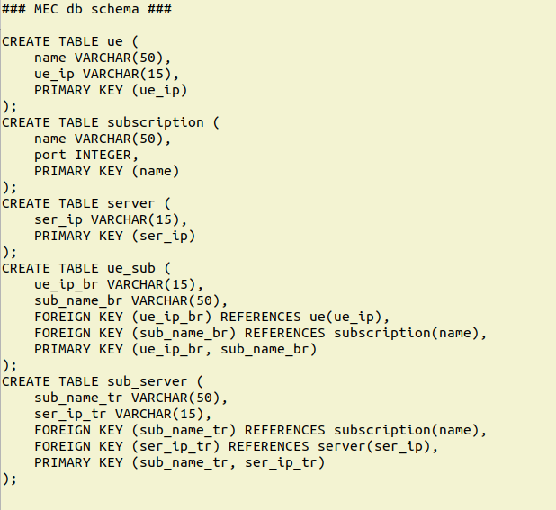

MEC rest_api
============

This repo contains the MEC rest-api code based on Flask and Flask-RESTPlus.

The repo was based on code from this blog:
http://michal.karzynski.pl/blog/2016/06/19/building-beautiful-restful-apis-using-flask-swagger-ui-flask-restplus/

## Quick Start 

1. What to install

virtualenv
`pip install virtualenv`

2. Setting up the application on your machine
```bash
$ git clone https://github.com/maxholli/restapi_MEC.git
$ cd restapi_MEC
$ virtualenv -p `which python3` venv
$ source venv/bin/activate
(venv) $ pip install -r requirements.txt
(venv) $ python setup.py develop
(venv) $ python rest_api_demo/app.py
```

3. Open http://localhost:8888/api/

## MEC restapi details

### 1. This api should appear when you run ./app.py.


This api allows the user to interact with the MEC database. This database holds all of the UE, Subscriptions, Servers, and their relationships to each other.

### 2. MEC database schema



And the ER Diagram


The UE, Server, and Subscription all get there own entities. This is so we can add attributes if need. For example, the server might be more than just an IP address.

With the api you can add/delete/modify UEs, Subscriptions and so on...

Try out the:
`GET /mec/ue/{ip}/subscription_servers` button with the **ip** value 10.1.1.1

You should see a UE linked to multiple subscriptions with multiple server IPs.

### 3. The resulting json should match the following relationship: 

